# Image Processing / Vision Course Project — Amit & Alon

Evaluating the **robustness** of image processing / vision algorithms applied
to **road scenes and vehicles**, under realistic distortions (motion blur,
low light, rain), and measuring how much of the lost performance can be
recovered via pre-processing enhancement and model fine-tuning.

## Team

| Name | Email | Tasks owned |
|---|---|---|
| Amit | TODO (fill in) | Feature matching (Task 2), Vehicle detection (Task 3) |
| Alon | TODO (fill in) | Lane detection (Task 1) |

## 1. Dataset

**Source:** [BDD100K (Berkeley DeepDrive)](https://bdd-data.berkeley.edu/) — public driving-scene dataset.

| Sub-folder | Used for | # samples | Format |
|---|---|---|---|
| `1_data_lane_detection_low_level/` | Task 1 — Lane detection | 300 images | single `.jpg` frames |
| `2_data_feature_matching_high_level/` | Task 2 — Feature matching | 178 pairs, drawn from consecutive frames of **a single driving video** | consecutive `.jpg` frames |
| `3_data_vehicle_detection_deep_learnning/` | Task 3 — Vehicle detection | 300 images — **the same 300 images as Task 1** (deliberately aligned, see section 2) | single `.jpg` frames |

**Sample images:**

| Task 1 (lane detection) | Task 2 (feature matching) | Task 3 (vehicle detection) |
|---|---|---|
|  |  |  |
|  |  |  |
|  |  |  |

Task 2's two right-hand samples above are frames `00000015` and `00000100`
of the same video sequence — an actual matched pair, not two unrelated
images, to illustrate what the matching pipeline is given.

## 2. Ground Truth

| Task | Uses real GT? | What the GT is |
|---|---|---|
| 1 — Lane detection | No (pseudo-GT) | — |
| 2 — Feature matching | No (pseudo-GT) | — |
| 3 — Vehicle detection | **Yes** | Real BDD100K box2d vehicle annotations (`car`/`truck`/`bus`/`motorcycle`/`bicycle`), extracted for our exact 300-image subset into `data/gt_labels/task3_vehicle_gt.csv` |

**Pseudo-GT** (Tasks 1 & 2) means: we don't have human-labeled ground truth
for these two tasks (lane markings and feature-matching correctness aren't
covered by the label files we have), so each method's own output on the
**clean** image is treated as the reference, and every distorted/enhanced
run is scored against that clean-image output instead. This is the course's
own stated fallback methodology when no GT is available.

Task 3's 300-image subset was deliberately chosen to be identical to Task
1's 300 images, which happened to give **100% real-GT coverage** (the
original, larger 675-image candidate set only had 60.6% coverage — see
section 8 for why).

## 3. Distortions

We chose **motion_blur**, **low_light**, **rain** (the course's own example
slide lists "noise, rain, low-light" as valid choices; we substituted a
structured `motion_blur` for generic Gaussian noise since blur is a more
common real-world driving-camera artifact than sensor noise). Each is swept
across **9 severity levels**, from mild to extreme, reported on plots as
**achieved SNR (dB)**:

```
SNR(dB) = 10 * log10( mean(clean^2) / mean((clean - distorted)^2) )
```

| Distortion | Parameter swept | Range (level 1 → 9) |
|---|---|---|
| `motion_blur` | linear motion-blur kernel size | 3 → 25 px |
| `low_light` | brightness scale factor (+ gamma=1.5) | 0.9 → 0.1 |
| `rain` | rain-streak density | 0.01 → 0.45 |

**`motion_blur`, levels 1-9:**


**`low_light`, levels 1-9:**


**`rain`, levels 1-9:**


## 4. Tasks, Levels & Methods

| # | Task | Level | Method | Library |
|---|---|---|---|---|
| 1 | Lane detection | Low Level | Canny edges + Hough transform + weighted-regression line merge | OpenCV |
| 2 | Feature matching | High Level | ORB + BFMatcher (Hamming) + Lowe's ratio test + RANSAC homography | OpenCV |
| 3 | Vehicle detection | Deep Learning (DL) | YOLOv8n, pretrained on COCO, fine-tuned in Part 4 | ultralytics |

## 5. Metrics

### Task 1 — Lane detection
- **`survival_rate`** = fraction of lane-line detections neither *lost* nor
  displaced more than `config.MAX_ERROR_PX` (45px) from the clean-image
  pseudo-GT — the single headline metric (combines both the left and right
  lane line into one number, rather than reporting them separately).

### Task 2 — Feature matching
- **`inlier_ratio`** = RANSAC inliers / good matches — match *accuracy*.
- **`match_ratio_vs_baseline`** = good matches / min(keypoints in the two
  **clean-baseline** frames, fixed per pair) — match *coverage* relative to
  a stable reference. (Normalizing by the *clean* baseline's keypoint count
  rather than the current, possibly-distorted image's own count avoids a
  metric artifact we hit early on — see `outputs/csv_results/task2/` and
  `enhancements.py`'s comments for the full story.)

### Task 3 — Vehicle detection
Scored via class-aware greedy IoU-matching (IoU ≥ 0.5) against real BDD100K
GT, reported both per class and aggregated:
- **`matched_recall`** = matched boxes / GT boxes.
- **`mean_iou_matched`** — localization quality of the boxes that *were* recovered.
- **`retention_ratio`** = total detections / GT count (can exceed 1 with false positives).

This particular 300-image subset has zero `motorcycle`/`bicycle` GT
instances, so those two classes have no per-class results.

## 6. Part 1 — Baseline (clean images)

| Task | Metric | Value |
|---|---|---|
| Lane detection | survival_rate reference (left/right line detected) | 98.7% / 99.3% of the 300 images |
| Feature matching | inlier_ratio | 0.553 |
| Feature matching | match_ratio_vs_baseline | 0.083 (reference value only — 1.0 by construction) |
| Vehicle detection | recall vs. real GT | 0.366 |
| Vehicle detection | mean IoU (matched detections) | 0.831 |

**Method + result, one clean-image example per task:**

| Task 1 (lane detection) | Task 2 (feature matching) | Task 3 (vehicle detection) |
|---|---|---|
| 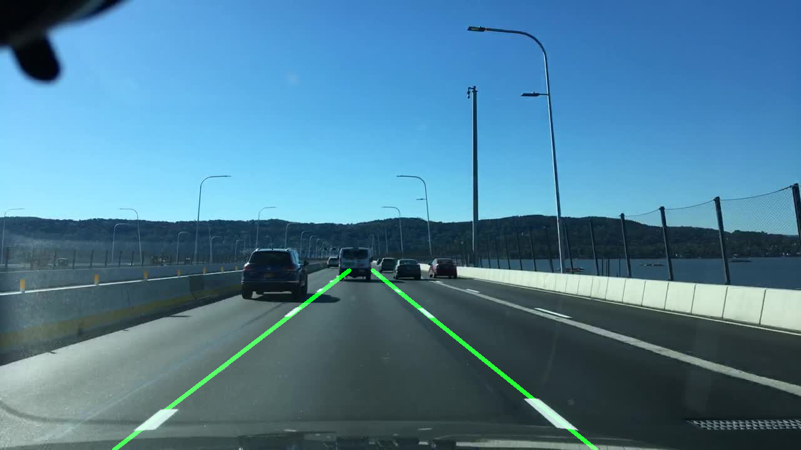 | 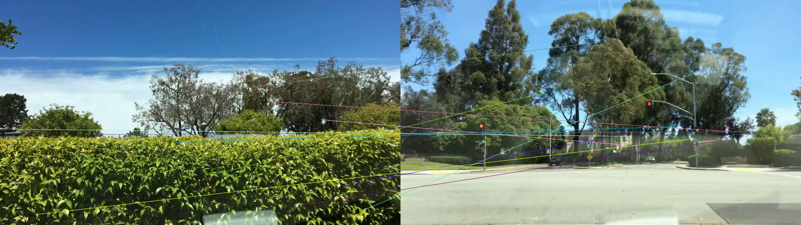 | 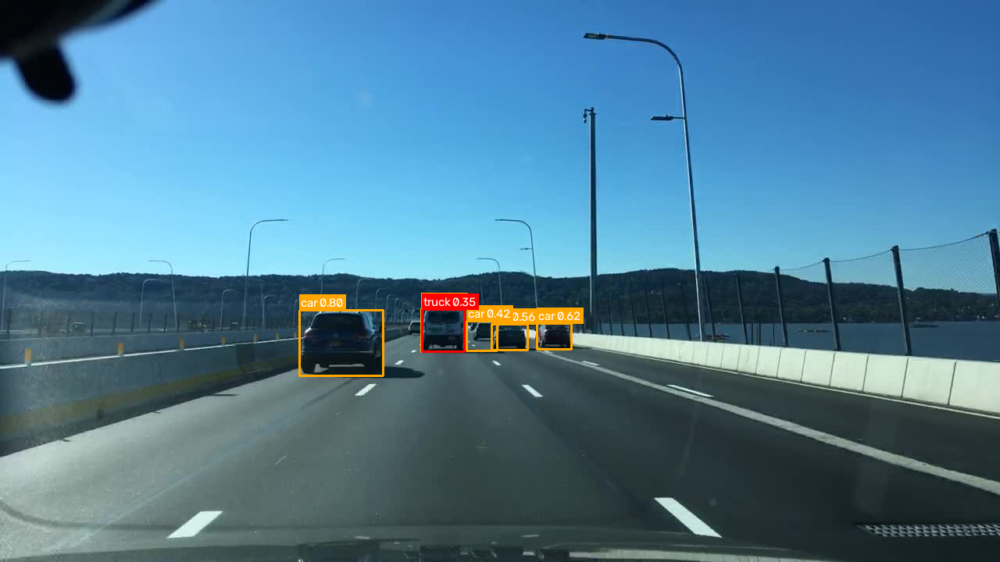 |

**Per-class, on clean images (Task 3):**


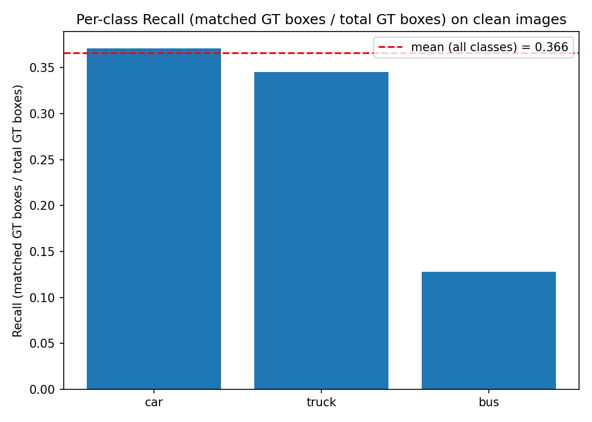

> *`bus` gets the most accurate boxes when found (IoU 0.94) but is found
> least often (recall 0.13, only 5 GT instances total in this subset);
> `car` is the opposite (IoU 0.83, recall 0.37) — the far more numerous,
> more familiar-to-COCO class is consistently found, just with slightly
> looser boxes. IoU measures *localization quality of what's found*; recall
> measures *how much of what exists gets found at all* — the two can (and
> here do) rank classes in opposite orders.*

## 7. Part 2 — Distortion sweep (performance per SNR, per distortion)

### Task 1 — Lane detection
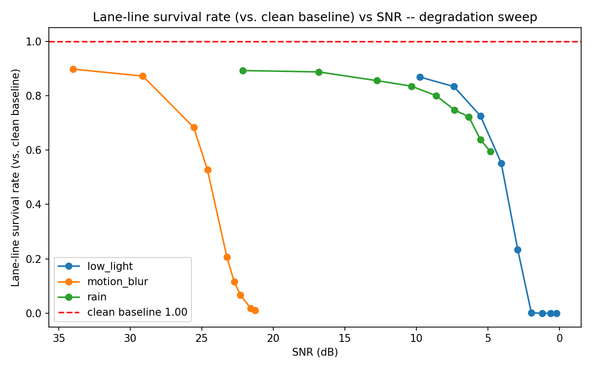

> *Survival rate holds close to 0.87–0.90 across all three distortions at
> mild severity, then diverges: `low_light` and `motion_blur` collapse
> almost completely at extreme severity (no edges left to find at all),
> while `rain` degrades far more gently (0.89→0.59) — streaks add clutter
> but don't destroy the underlying lane-edge gradients the way total
> darkness or heavy blur do.*

### Task 2 — Feature matching

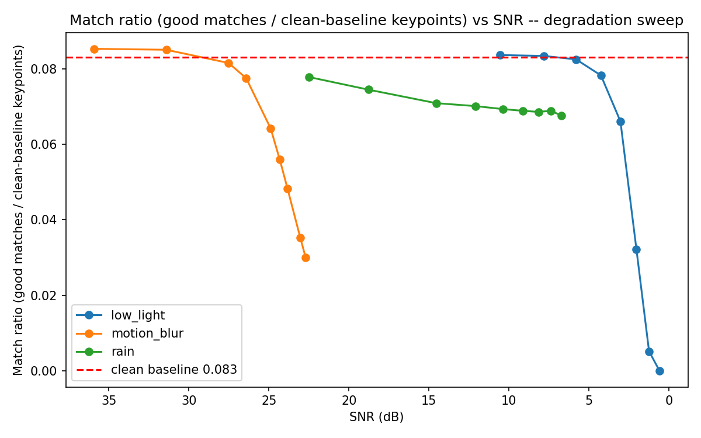

> *`inlier_ratio` stays relatively flat/noisy across severity — RANSAC's
> geometric check is fairly binary regardless of how few candidates remain.
> `match_ratio_vs_baseline` tells the more informative story: it decreases
> monotonically for all three distortions, most dramatically for
> `motion_blur` and `low_light` — heavy blur/darkness doesn't just reduce
> match accuracy, it destroys the underlying features to match against.*

### Task 3 — Vehicle detection


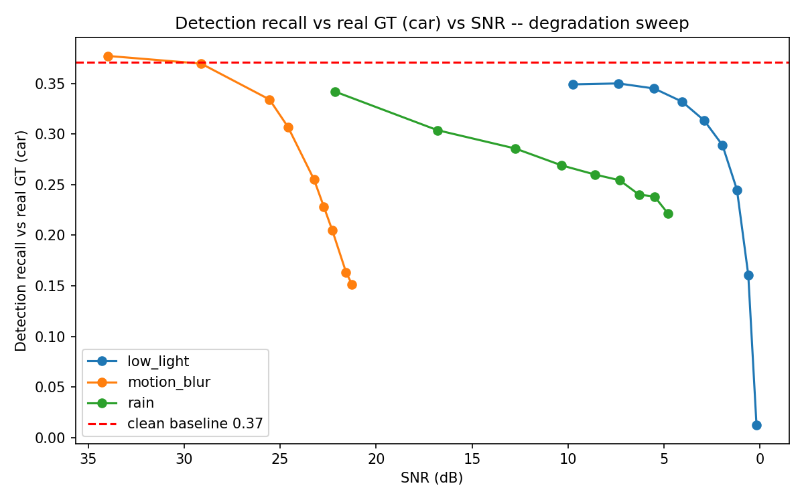
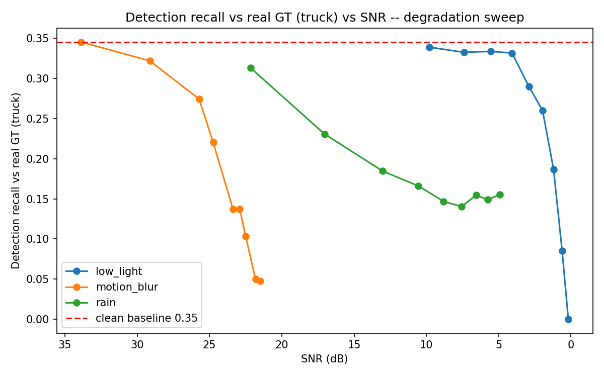
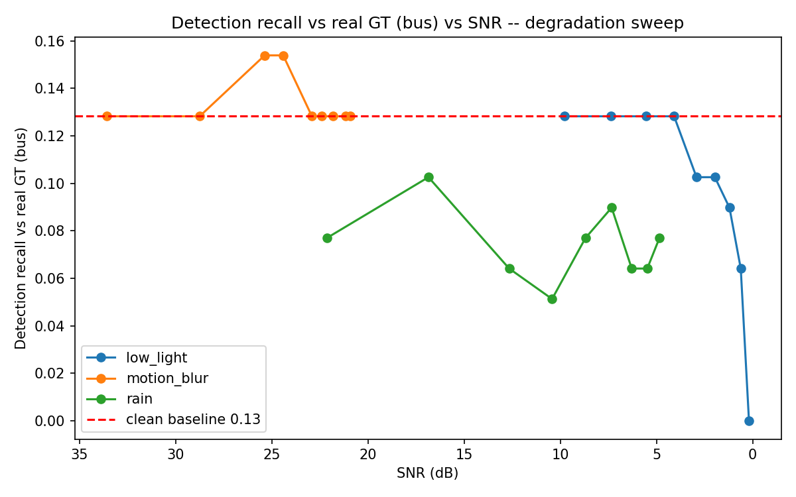

> *Recall degrades monotonically for all three distortions, `low_light`
> most severely. Mean IoU of the detections that ARE found stays stable
> throughout (0.82–0.86) — the dominant failure mode under distortion is
> missed detections entirely, not inaccurate boxes.*

Before/after sample images: `outputs/visualizations/task{1,2,3}/degraded_visualizations/<distortion>/level_<n>/`.

## 8. Part 3 — Enhancement (pre-processing recovery)

Fixed, severity-independent restoration applied to each distortion
(`enhancements.py`):

| Distortion | Enhancement | Technique |
|---|---|---|
| `motion_blur` | `restore_motion_blur` | Unsharp masking (Gaussian blur + weighted subtract) |
| `low_light` | `restore_low_light` | Gamma lift (γ=0.45) + CLAHE on the L channel (LAB space) |
| `rain` | `restore_rain` | Edge-preserving bilateral filter |

**Before / after example** (`low_light`, level 5, one image per task):

| Task | Distorted | Enhanced |
|---|---|---|
| 1 — Lane detection | 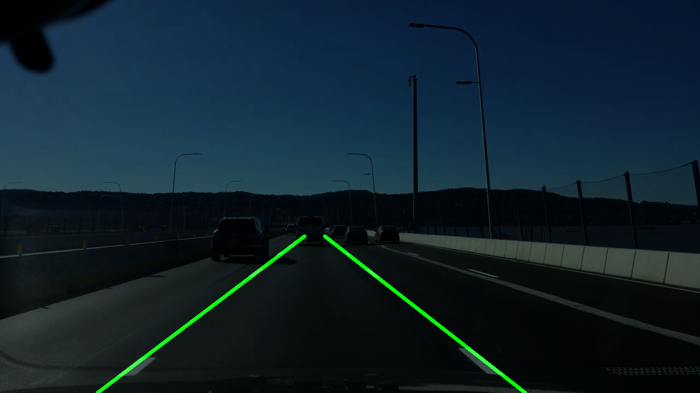 | 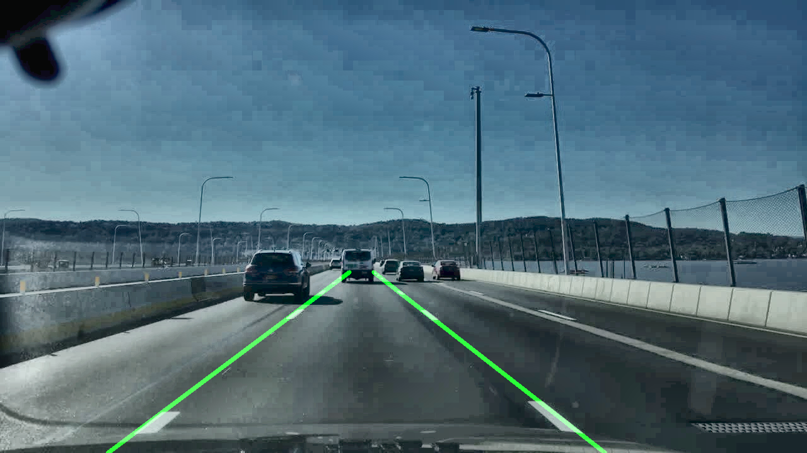 |
| 2 — Feature matching | 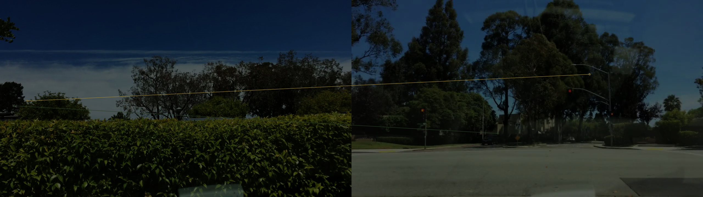 | 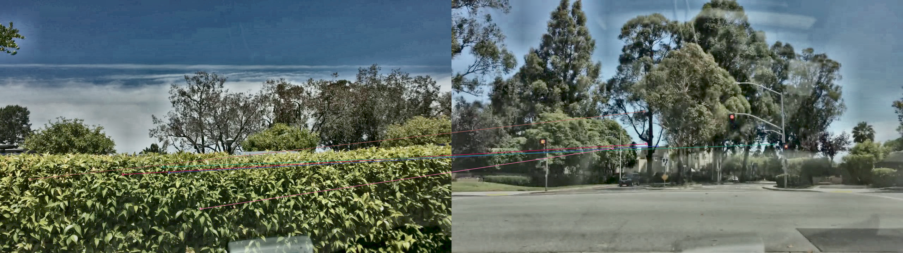 |
| 3 — Vehicle detection | 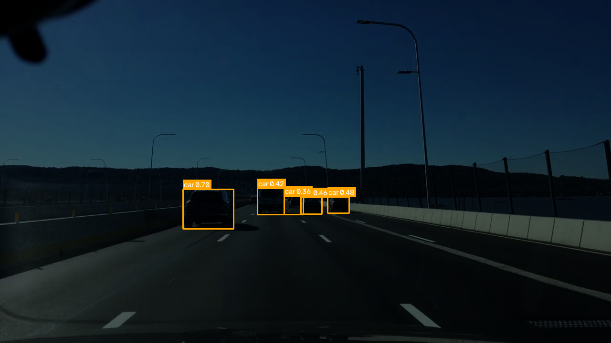 | 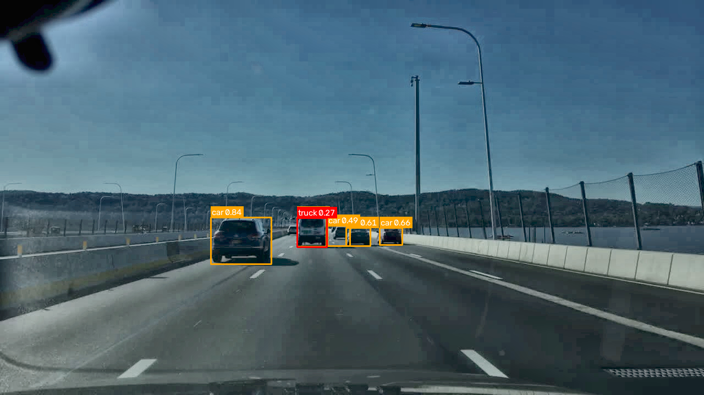 |

**Performance per distortion** (mean across all 9 levels, distorted vs. enhanced vs. clean baseline):

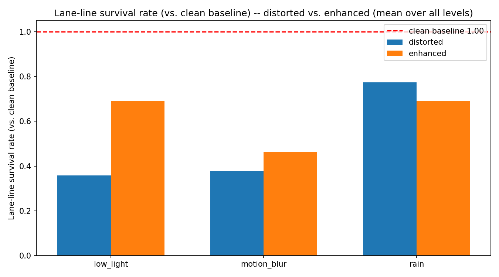


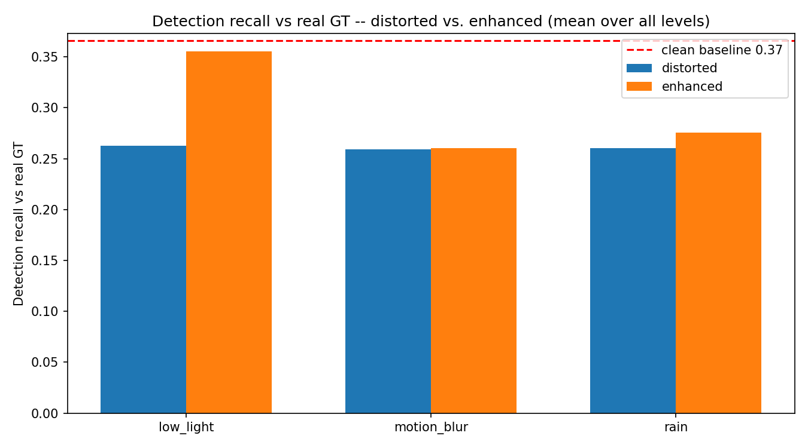


> *Enhancement helps, unevenly. Task 1's survival rate improves clearly for
> `low_light`/`motion_blur`, but `rain` actually gets slightly worse — the
> bilateral de-rain filter smooths the same thin edges Hough needs, along
> with the rain streaks. Task 2's match ratio improves for `motion_blur`/
> `rain`, roughly flat for `low_light`. Task 3's recall improves for
> `low_light`/`rain`, flat for `motion_blur` — enhancement functions tuned
> for one distortion don't uniformly transfer to a different failure mode.*

Before/after/restored sample images:
`outputs/visualizations/task{1,2,3}/enhanced_visualizations/<distortion>/level_<n>/`.

## 9. Part 4 — Fine-tuning (Task 3 only)

`yolov8n.pt` fine-tuned on distorted Task 3 images, labeled with **real
BDD100K GT** (no pseudo-labels needed, since we have real GT for this task).

- **Training set:** all 300 images, each distorted at a fixed moderate
  severity (level 5/9), round-robin across the 3 distortions. 80/20
  train/val split (240/60 images) → `data/finetune_dataset/`
  (`Amit_project/build_finetune_dataset.py`).
- **Fine-tuning:** `yolov8n.pt` → 15 epochs, batch=8, imgsz=640, CPU. Final
  validation: mAP50=0.222, mAP50-95=0.142
  (`Amit_project/finetune_vehicle_detection.py` →
  `Amit_project/yolov8n_finetuned.pt`).
- **Comparison:** full distortion sweep re-run with the fine-tuned weights
  (`outputs_finetuned/task3/`), compared against the pretrained
  distorted/enhanced results (`Amit_project/compare_finetuned_vs_pretrained.py`).


**Mean recall across all 9 levels:**

| Distortion | pretrained + distorted | pretrained + enhanced | fine-tuned + distorted |
|---|---|---|---|
| `low_light` | 0.262 | 0.355 | **0.414** |
| `motion_blur` | 0.259 | 0.261 | **0.451** |
| `rain` | 0.260 | 0.275 | **0.452** |

> *Fine-tuning clearly wins on all three distortions, and the gap over
> enhancement is largest exactly where enhancement helped least
> (`motion_blur`, `rain`). Enhancement tries to make a distorted image
> "look clean" to an unchanged model; fine-tuning directly adapts the
> model's weights to the distorted domain, which generalizes better when
> the enhancement itself is an imperfect proxy for the original clean
> signal. The advantage narrows only at the most extreme low-light levels,
> where information loss is severe enough that neither approach fully
> recovers it.*

## 10. Repository structure

```
config.py                            # central path config, shared constants, BDD100K category map
enhancements.py                      # Part 3 restoration functions per distortion (shared, all 3 tasks)

Amit_project/
  augmentations_AMIT.py              # distortion functions: apply_motion_blur / apply_low_light / apply_rain
  augmentation_levels.py             # builds the 9 severity levels + SNR computation (shared, all 3 tasks)
  feature_matching_bdd100k.py        # ORB feature matching core (process_pair)
  vehicle_detection_bdd100k.py       # YOLOv8n detection core (process_image)
  run_feature_matching_degradation.py  # Task 2 driver: baseline + distorted + enhanced sweep
  run_vehicle_detection_degradation.py # Task 3 driver: baseline + distorted + enhanced sweep, real GT, per-class
  build_finetune_dataset.py          # Task 3 Part 4: distorted training set + real-GT labels
  finetune_vehicle_detection.py      # Task 3 Part 4: fine-tune yolov8n.pt
  compare_finetuned_vs_pretrained.py # Task 3 Part 4: final comparison plots
  yolov8n.pt / yolov8n_finetuned.pt  # pretrained / fine-tuned YOLOv8-nano weights

src_Alon/
  lane_detection/
    lane_detection_pipeline.py       # Task 1 core (process_image)
    run_lane_detection_degradation.py  # Task 1 driver: baseline + distorted + enhanced sweep
  helper_files/
    extract_task3_gt.py              # extracts real BDD100K box2d GT for Task 3's image subset
    filter_bdd100k.py, import_tags.py  # BDD100K dataset curation utilities
  archive/                            # superseded disk-based Task 1 scripts, kept for reference

tools/
  build_distortion_grids.py          # generates the 9-level distortion example grids (section 3)
  make_smoke_test_sample.py          # small dev sample for fast iteration/quick-checks

outputs/
  csv_results/task{1,2,3}/           # CSVs (baseline, degraded, enhanced, level summaries)
  graph_results/task{1,2,3}/         # summary plots (bar/line charts)
  visualizations/task{1,2,3}/        # before/after/enhanced sample images
outputs_finetuned/task3/             # fine-tuned model's sweep results (Part 4)
```

## 11. How to run

```bash
# Task 1 — lane detection (baseline + distortion sweep + enhancement, in-memory)
# run from inside src_Alon/lane_detection/
python run_lane_detection_degradation.py --num_levels 9

# Task 2 — feature matching (baseline + distortion sweep + enhancement)
# run from inside Amit_project/
python run_feature_matching_degradation.py --num_levels 9

# Task 3 — vehicle detection (baseline + distortion sweep + enhancement, real GT)
# run from inside Amit_project/ -- requires data/gt_labels/task3_vehicle_gt.csv
# (generate first: python ../src_Alon/helper_files/extract_task3_gt.py)
python run_vehicle_detection_degradation.py --num_levels 9

# Part 4 — fine-tuning (Task 3 only), run from inside Amit_project/
python build_finetune_dataset.py
python finetune_vehicle_detection.py
python compare_finetuned_vs_pretrained.py
```

All scripts run fully in-memory for evaluation (no augmented dataset is ever
written to disk in bulk) — only one before/after sample image per
(distortion, level, stage) is saved. Omit `--out_dir` to use the default
unified layout (`outputs/{csv_results,graph_results,visualizations}/task{n}/`).

## 12. Known limitations

- **Pseudo-GT, not human-labeled GT**, for Tasks 1 & 2 — see section 2.
- **Task 3's `motorcycle`/`bicycle` classes have zero GT instances** in this
  300-image subset, so those two classes have no per-class results.
- **Task 3's clean-image folder was pruned from 675 → 300 images** to match
  Task 1 exactly and guarantee 100% real-GT coverage (the excluded 375
  images appear to be BDD100K MOT/tracking frames, not part of the labeled
  detection set).
- **105 of the original 300 Task 3 images were corrupt at the source**
  (all-zero byte content) — found and fixed during Part 4 setup by
  substituting valid copies from the full BDD100K 100k-image set. All Task
  3 numbers in this README are post-fix.
- **Fine-tuning used a small, fixed-severity training set** (240 images, one
  distortion/level each, 15 epochs on CPU) — a larger, more varied training
  set would likely improve the fine-tuned model further.
- **SNR is a uniform-noise proxy**; it does not perfectly reflect perceptual
  severity for structured distortions like rain.

---

**Before submission:** fill in team emails above, register the project in
the course's project register, and prepare the final PPT (easy-to-read
version of this README).
