# Robust Autonomous Driving Under Image Distortions

## Project Overview

This project evaluates the **robustness** of classical image-processing and
deep-learning computer-vision algorithms for autonomous driving, under
realistic image distortions encountered on the road (low light, motion
blur, rain). We measure how much each method's performance degrades as
distortion severity increases, and how much of that lost performance can be
recovered through two independent strategies: pre-processing **enhancement**
(restoring the image before running the method) and **fine-tuning** (adapting
the model itself to distorted inputs).

**Goal:** Evaluate robustness of image processing and computer vision
algorithms for autonomous driving under realistic image distortions, across
three tasks spanning classical low-level vision, classical high-level
vision, and deep learning.

**Team:**

| Name | Email | Tasks owned |
|---|---|---|
| Amit | amit17ashkenazi@gmail.com | Task 2 — Feature Matching, Task 3 — Vehicle Detection, Fine-Tuning |
| Alon | alon.kenan.ee@gmail.com | Task 1 — Lane Detection |

---

# How to Run

**Required Python packages:**
```
opencv-python, numpy, pandas, matplotlib, ultralytics, ijson
```
(install with `pip install opencv-python numpy pandas matplotlib ultralytics ijson`
— the repo's `requirements.txt` is currently out of date and should be
regenerated from this list.)

**Data:** clean images must be present under `data/clean_images/{1,2,3}_data_.../`
(not tracked in git — see the Repository Structure section). Task 3 also
needs `data/gt_labels/task3_vehicle_gt.csv` (real BDD100K ground truth,
generate once with `src_Alon/helper_files/extract_task3_gt.py`).

**Task 1 — Lane Detection** (run from `src_Alon/lane_detection/`):
```bash
python run_lane_detection_degradation.py --num_levels 9
```

**Task 2 — Feature Matching** (run from `Amit_project/`):
```bash
python run_feature_matching_degradation.py --num_levels 9
```

**Task 3 — Vehicle Detection** (run from `Amit_project/`):
```bash
python ../src_Alon/helper_files/extract_task3_gt.py   # once, before the first run
python run_vehicle_detection_degradation.py --num_levels 9
```

**Fine-Tuning** (Task 3 only, run from `Amit_project/`):
```bash
python build_finetune_dataset.py
python finetune_vehicle_detection.py
python compare_finetuned_vs_pretrained.py
```

Every driver runs fully in-memory for evaluation (distorted/enhanced images
are never bulk-written to disk) and defaults to writing CSVs/plots/sample
images to `outputs/{csv_results,graph_results,visualizations}/task{n}/`.

---

# 1. Dataset

## 1.1 BDD100K Dataset Overview

[BDD100K (Berkeley DeepDrive)](https://bdd-data.berkeley.edu/) is a
large-scale autonomous-driving road-scene dataset: images and videos
collected from real, diverse driving scenarios (highway, city streets,
different weather/lighting conditions), with object, lane, and drivable-area
annotations. It is the source dataset for all three tasks in this project.

## 1.2 Dataset Organization

Two datasets are used in this project:

| Dataset | Used for | Description |
|---|---|---|
| Dataset 1 | Task 1 - Lane Detection + Task 3 - Vehicle Detection | Clean road scene images from BDD100K |
| Dataset 2 | Task 2 - Feature Matching | Consecutive frames extracted from a driving video |

Dataset 1 is used identically for both Task 1 and Task 3 (300 images each,
the same 300 physical images — chosen deliberately so Task 3 gets 100% real
ground-truth coverage, see section 2.3). Dataset 2 contains 178 pairs drawn
from consecutive frames of **a single driving video**, so that feature
matching is performed between visually and geometrically related frames
rather than arbitrary unrelated images.

## 1.3 Dataset Examples

Examples from Dataset 1 (Task 1 + Task 3):

| Image 1 | Image 2 | Image 3 |
|---|---|---|
| 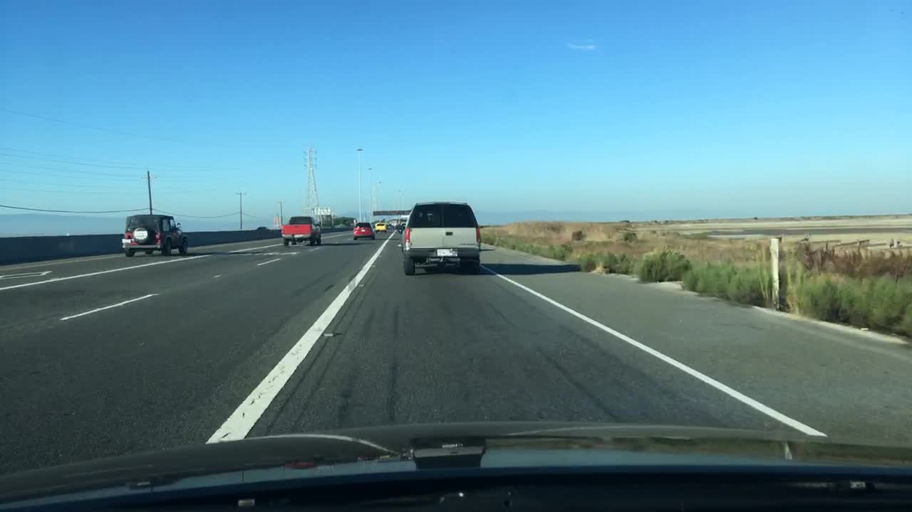 | 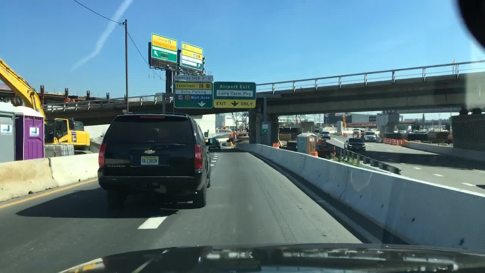 | 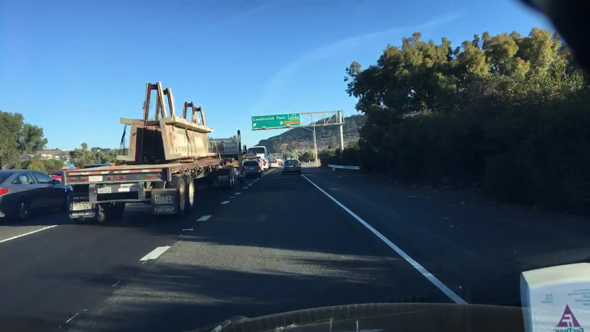 |

Examples from Dataset 2 (Task 2 - Feature Matching):

| Image 1 | Image 2 | Image 3 |
|---|---|---|
| 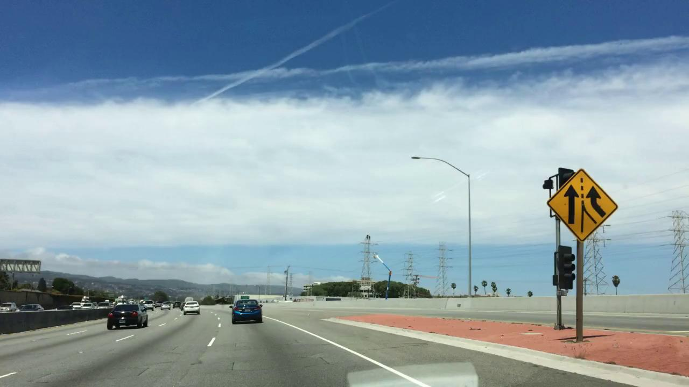 | 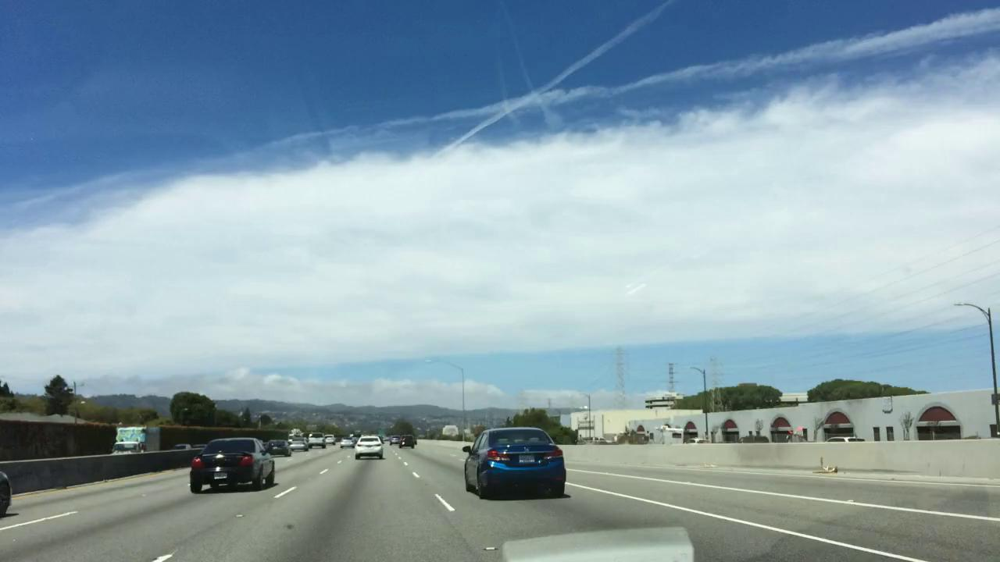 | 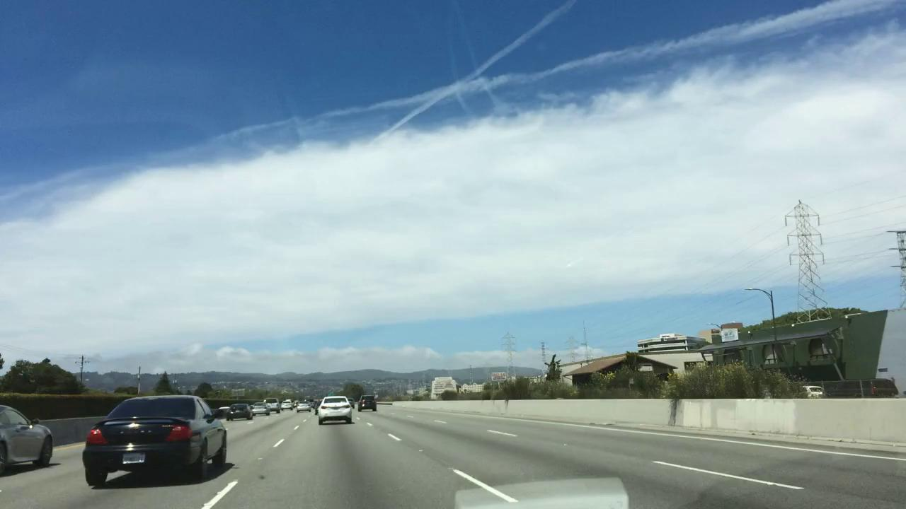 |

The images used for Task 2 were selected from the same driving sequence,
representing consecutive frames (5-frame spacing) from a video — this is
what gives the ORB/RANSAC pipeline real visual overlap to match against.

---

# 2. Tasks and Baseline Results

## 2.1 Task Overview

| Task | Goal | Method | Level |
|---|---|---|---|
| Task 1 | Lane Detection | Canny + Hough Transform | Low Level |
| Task 2 | Feature Matching | ORB + BFMatcher + RANSAC | High Level |
| Task 3 | Vehicle Detection | YOLOv8 | Deep Learning |

---

# Task 1: Lane Detection

## Task Description

Lane detection identifies the ego-vehicle's lane boundaries from a
dashcam-style image — a core low-level building block for lane-keeping and
path-planning in autonomous driving; missed or displaced lane lines directly
threaten safe lane-keeping.

Main algorithm steps (`src_Alon/lane_detection/lane_detection_pipeline.py`):
grayscale + Gaussian blur → Canny edge detection → trapezoidal region-of-interest
mask → morphological closing (bridges broken/dashed markings) → probabilistic
Hough transform → slope/position filtering (separates left/right candidates)
→ outlier rejection → weighted linear regression to merge each side into one
line.

## Clean Image Results

Clean lane detection examples:

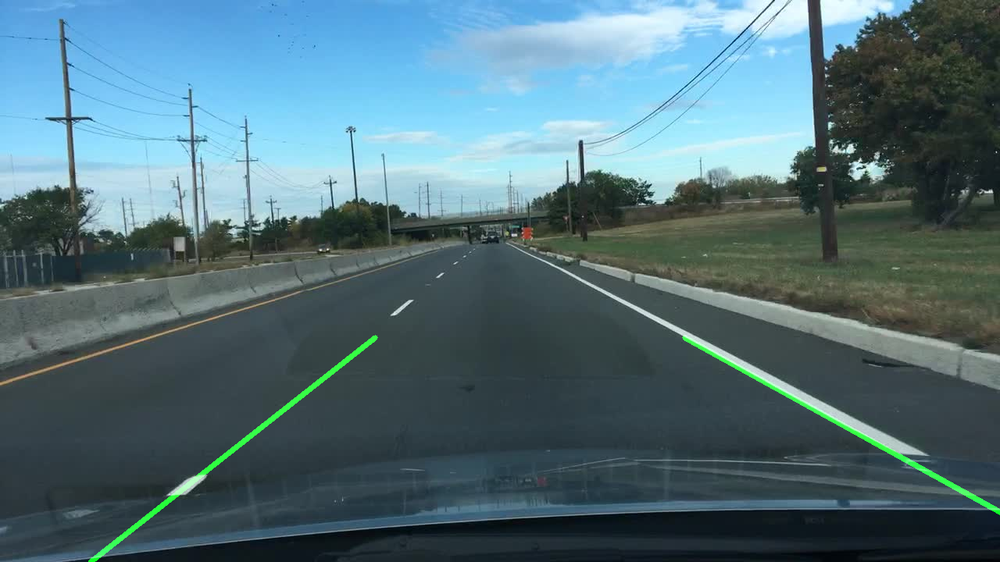

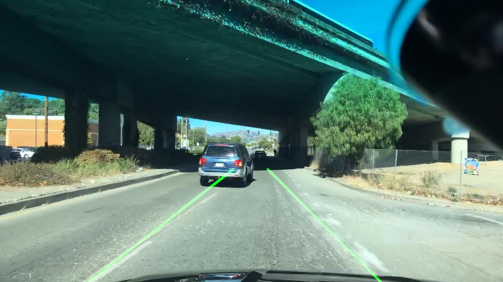


---

# Task 2: Feature Matching

## Task Description

Feature matching finds corresponding points between two frames of the same
scene — the building block behind visual odometry, structure-from-motion,
and tracking. Using two frames from the same driving sequence (not arbitrary
images) means there is genuine visual overlap to match, mimicking how a
moving vehicle would use frame-to-frame matching in practice.

Pipeline (`Amit_project/feature_matching_bdd100k.py`): ORB keypoint detection
→ BFMatcher (Hamming distance) k-NN matching → Lowe's ratio test (keeps only
unambiguous matches) → RANSAC homography estimation (keeps only geometrically
consistent "inlier" matches).

## Clean Image Results

Feature matching visualization:

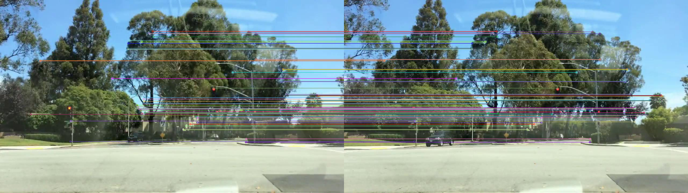

---

# Task 3: Vehicle Detection

## Task Description

Vehicle detection locates and classifies vehicles (car/truck/bus/motorcycle/
bicycle) in a road-scene image — a high-level perception task feeding
directly into collision avoidance and behavior prediction. We use **YOLOv8n**
(nano), first pretrained on COCO, later fine-tuned on distorted driving
images (Part 5).

**Note:** Task 3 uses real Ground Truth annotations from BDD100K (unlike
Tasks 1 and 2, which use pseudo-GT — see section 2.3).

## Clean Image Results

Vehicle detection visualization:


---

# 2.2 Evaluation Metrics

Each task is reported with **one single headline metric**, chosen (from a
short-list of candidates computed during development) for being the one
that actually tells a robustness story — i.e., moves meaningfully and
monotonically with distortion severity and enhancement/fine-tuning, rather
than staying flat/noisy regardless of what happens to the image:

| Task | Metric | What it measures |
|---|---|---|
| 1 — Lane Detection | `survival_rate` | Fraction of lane-line detections neither lost nor displaced >45px from the clean-image reference |
| 2 — Feature Matching | `match_ratio_vs_baseline` | Match coverage relative to the clean-image's keypoint budget |
| 3 — Vehicle Detection | `matched_recall` | Fraction of real GT boxes found |

## Task 1 Metrics

`survival_rate` is the single headline metric: a lane-line detection
"survives" a distortion/enhancement if it is neither *lost* entirely (no
line found where the clean image had one) nor displaced more than 45 pixels
at the bottom of the frame from where it was detected on the clean image
(our pseudo-GT reference, since we don't have human-labeled lane-marking GT
— see section 2.3). It combines the left and right lane line into one
number rather than reporting them separately.

## Task 2 Metrics

**`match_ratio_vs_baseline`** = good matches / min(keypoints in the two
**clean-baseline** frames, fixed per pair) — match *coverage* relative to a
stable reference. We normalize by the clean image's keypoint count (rather
than the current, possibly-distorted image's own count) because distortion
and enhancement both change raw keypoint yield a lot, which would otherwise
distort this ratio in counter-intuitive ways.

(`inlier_ratio`, RANSAC-consistent fraction of attempted matches, was also
computed during development but dropped as the reported metric — it stayed
flat/noisy across severity and didn't carry a robustness signal.)

## Task 3 Metrics

**`matched_recall`** = matched boxes / GT boxes, via class-aware greedy
IoU-matching (IoU ≥ 0.5) against real BDD100K GT boxes — core success
metric: what fraction of real vehicles present actually got detected.

(`mean_iou_matched`, localization quality of the boxes that were found, was
also computed during development but dropped as the reported metric — it
stayed nearly flat (0.82–0.86) across every severity level, so the dominant
failure mode under distortion is clearly *missed detections*, not
inaccurate boxes, and recall is what actually captures that.)

This particular 300-image subset has zero `motorcycle`/`bicycle` GT
instances, so those two classes have no per-class results.

---

# 2.3 Baseline Results on Clean Images

## Task 1 Baseline

On clean images, the pipeline detects a left lane line in 98.7% of the 300
images and a right lane line in 99.3% — near-ceiling, as expected for
well-lit, unobstructed highway/street scenes with visible markings. Since
Task 1's `survival_rate` is defined *relative to the clean-image detection*
(pseudo-GT), the clean-image baseline is 1.0 by construction — no
baseline graph required (qualitative results only, shown above).

## Task 2 Baseline

Feature matching visualization on clean image pairs:


Baseline metric results:

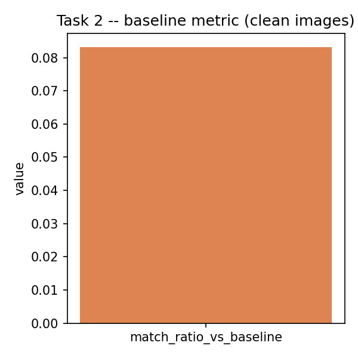

Baseline (mean over all 178 pairs): `match_ratio_vs_baseline` = 0.083 (1.0
by construction against itself; 0.083 is the raw absolute value the
SNR-sweep plot's reference line is drawn at).

## Task 3 Baseline

Vehicle detection visualization on clean images:


Baseline performance compared with Ground Truth:


Baseline (mean over 300 images, vs. real GT): recall = 0.366. Per class,
`car` is found most consistently (recall 0.37, by far the most numerous and
most COCO-familiar class), `bus` least often (recall 0.13, only 5 GT
instances total in this subset).

---

# 3. Image Distortions

## 3.1 Distortion Methods

Three realistic driving distortions, each swept across 9 severity levels
(mild → extreme), reported against **achieved SNR (dB)**:
```
SNR(dB) = 10 * log10( mean(clean^2) / mean((clean - distorted)^2) )
```

## Low Light

Simulates dusk/night/tunnel driving conditions (brightness scale factor +
gamma darkening). Low light is one of the most common and safety-critical
degradations for camera-based perception — both classical edge/keypoint
detectors and learned detectors lose signal as illumination drops.

Severity levels (Task 1's 300-image mean SNR per level):

| Level | Parameter (brightness factor) | SNR (dB) |
|---|---|---|
| 1 | 0.90 | 9.77 |
| 2 | 0.80 | 7.38 |
| 3 | 0.70 | 5.52 |
| 4 | 0.60 | 4.07 |
| 5 | 0.50 | 2.91 |
| 6 | 0.40 | 1.96 |
| 7 | 0.30 | 1.20 |
| 8 | 0.20 | 0.61 |
| 9 | 0.10 | 0.19 |

9-image grid (same image, levels 1 → 9, 3×3 layout):

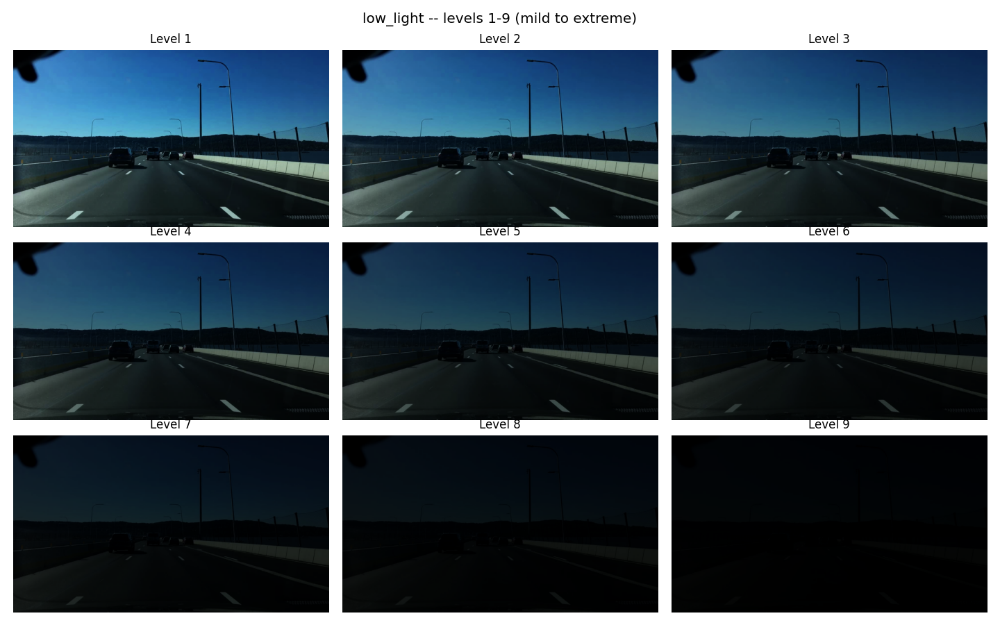

## Motion Blur

Simulates camera/vehicle motion during exposure (linear motion-blur kernel).
Common at higher driving speeds or on rough roads; smears edges and fine
texture, directly hurting both edge-based (Task 1) and keypoint-based
(Task 2) methods.

Severity levels:

| Level | Parameter (kernel size, px) | SNR (dB) |
|---|---|---|
| 1 | 3 | 33.99 |
| 2 | 5 | 29.13 |
| 3 | 8 | 25.57 |
| 4 | 11 | 24.60 |
| 5 | 14 | 23.25 |
| 6 | 17 | 22.74 |
| 7 | 19 | 22.30 |
| 8 | 22 | 21.58 |
| 9 | 25 | 21.28 |

9-image grid (same image, levels 1 → 9, 3×3 layout):

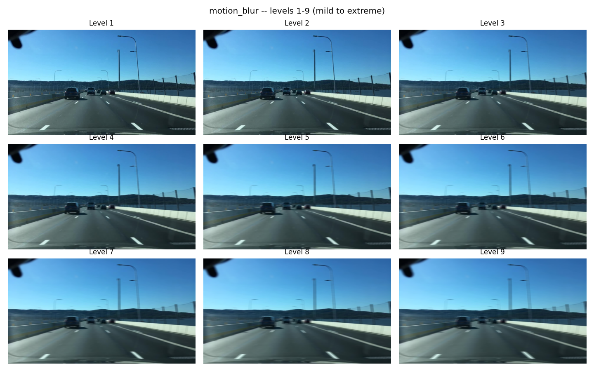

## Rain

Simulates rain-streak occlusion overlaid on the scene (streak density).
Adds high-frequency clutter without destroying the underlying scene
structure the way low light or heavy blur do — a qualitatively different
failure mode from the other two distortions.

Severity levels:

| Level | Parameter (streak density) | SNR (dB) |
|---|---|---|
| 1 | 0.01 | 22.14 |
| 2 | 0.06 | 16.83 |
| 3 | 0.12 | 12.77 |
| 4 | 0.17 | 10.35 |
| 5 | 0.23 | 8.61 |
| 6 | 0.29 | 7.34 |
| 7 | 0.34 | 6.33 |
| 8 | 0.40 | 5.52 |
| 9 | 0.45 | 4.82 |

9-image grid (same image, levels 1 → 9, 3×3 layout):

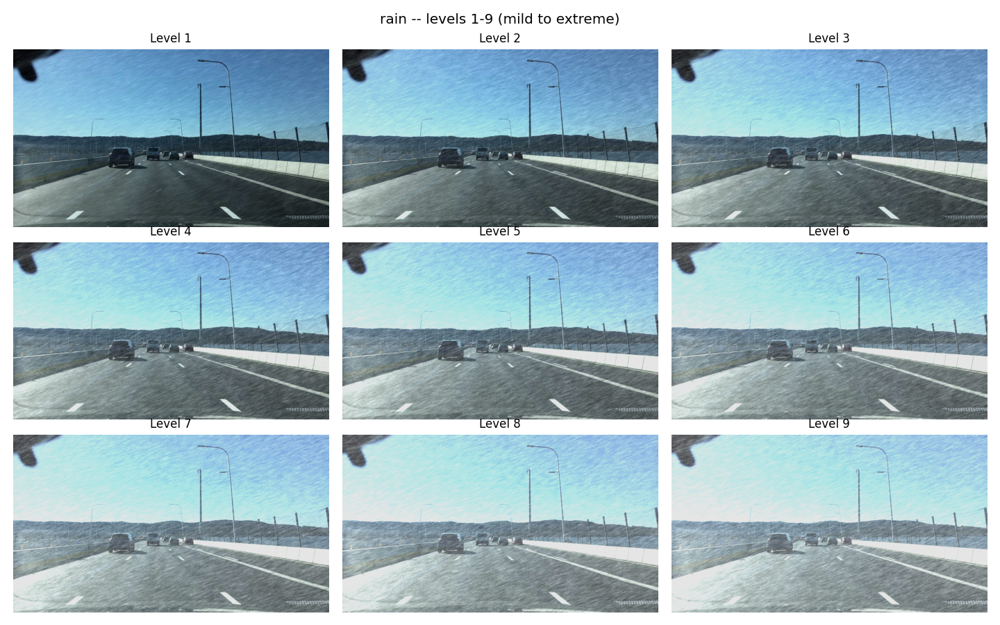

---

# 3.2 Results Under Distortions

## Task 1 - Lane Detection

3×3 grid — rows: motion_blur / low_light / rain; columns: Level 1 / Level 5
/ Level 9; each image shows the detected-lanes visualization:

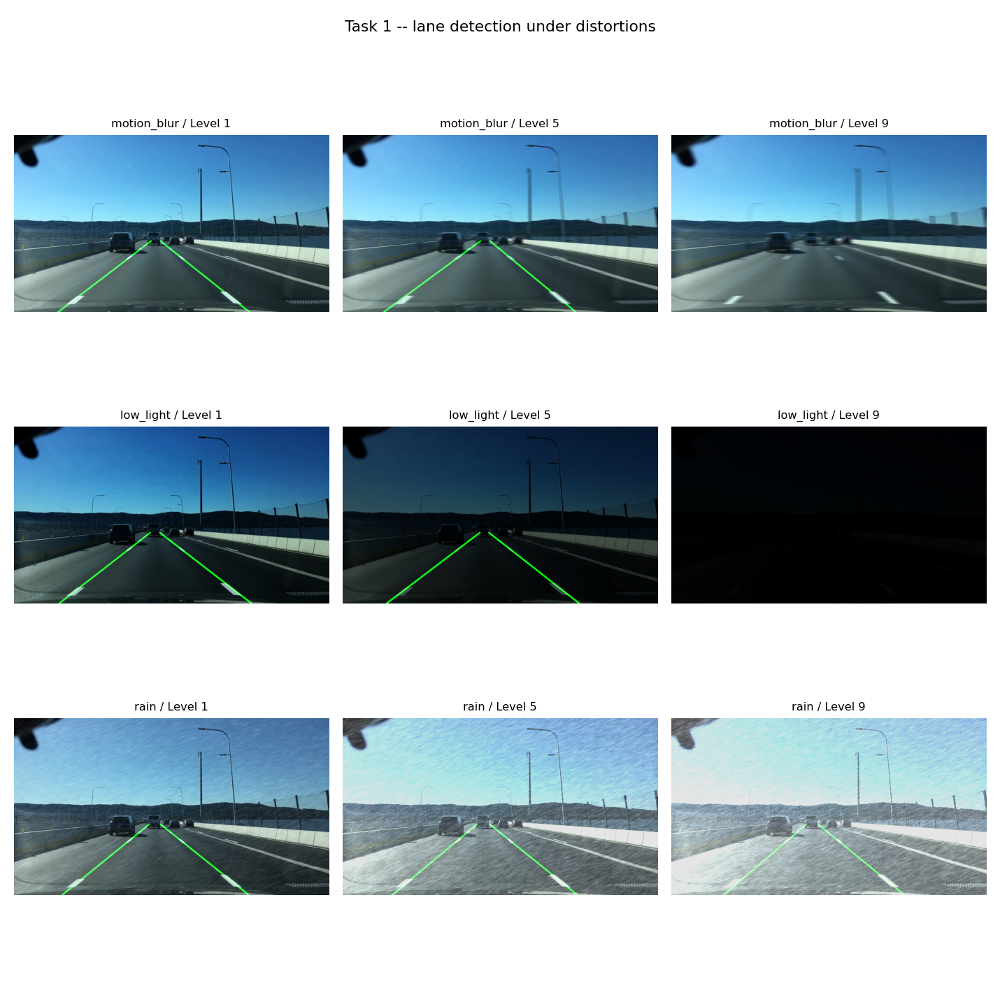

Metric performance vs. SNR:


Survival rate holds close to 0.87–0.90 across all three distortions at mild
severity, then diverges: `low_light` and `motion_blur` collapse almost
completely at extreme severity (no edges left to find at all), while `rain`
degrades far more gently (0.89→0.59).

## Task 2 - Feature Matching

3×3 grid — rows: motion_blur / low_light / rain; columns: Level 1 / Level 5
/ Level 9; feature matching visualization under different distortions/severities:

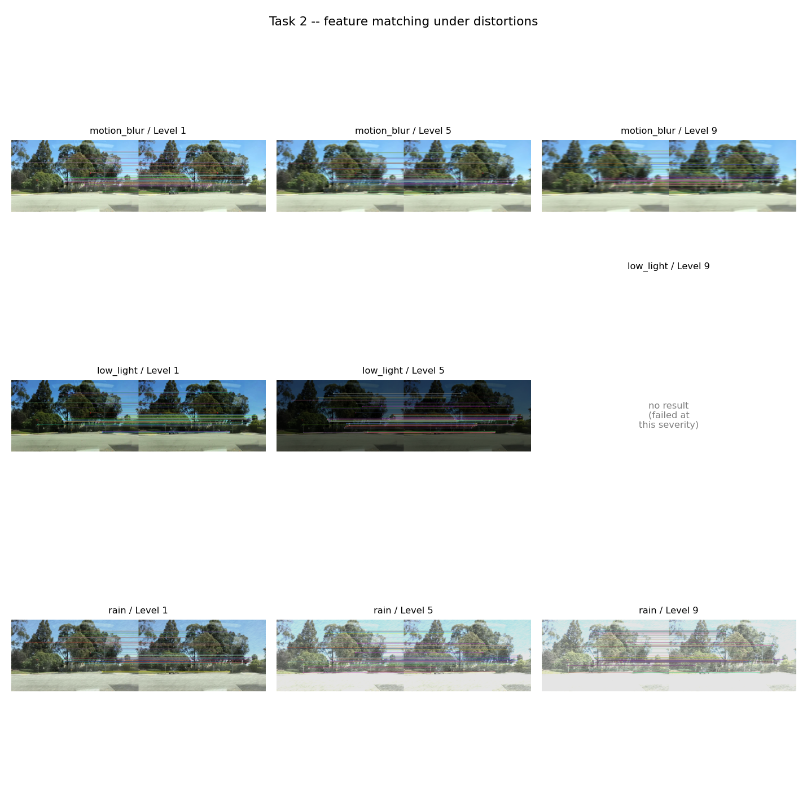

*(Note: `low_light` at level 9 has no visualization — the matching
pipeline found no surviving descriptors at that severity, a real result,
not a missing file.)*

Metric performance vs. SNR:


`match_ratio_vs_baseline` decreases monotonically for all three distortions,
most dramatically for `motion_blur` and `low_light` — heavy blur/darkness
doesn't just reduce match accuracy, it destroys the underlying features to
match against in the first place.

## Task 3 - Vehicle Detection

3×3 grid — rows: motion_blur / low_light / rain; columns: Level 1 / Level 5
/ Level 9; vehicle detection visualization under distortions:

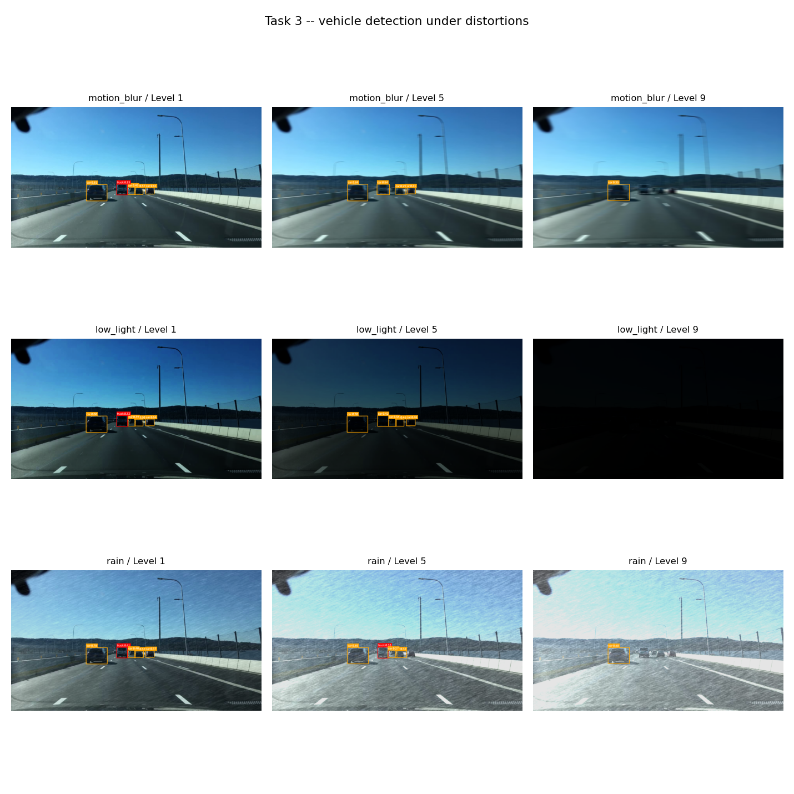

Detection performance vs. SNR:


Recall degrades monotonically for all three distortions, `low_light` most
severely — consistent with section 2.2's finding that localization quality
(IoU) stays roughly stable across severity, so recall is what actually
captures the degradation here.

---

# 4. Image Enhancements

## 4.1 Enhancement Methods

| Distortion | Enhancement method | Technique |
|---|---|---|
| Low Light | `restore_low_light` | Gamma lift (γ=0.45) + CLAHE on the L channel (LAB space) |
| Motion Blur | `restore_motion_blur` | Unsharp masking (Gaussian blur + weighted subtract) |
| Rain | `restore_rain` | Edge-preserving bilateral filter |

Enhancement is a fixed, severity-independent pre-processing step applied to
every distorted image before re-running each task's method — the goal is to
recover as much of the lost clean-image performance as possible *without*
changing the method itself (contrast with fine-tuning, Part 5, which instead
adapts the model).

## 4.2 Enhancement Results

Before and after enhancement examples (`low_light`, representative severity
level 5):

| Task | Distorted → Enhanced |
|---|---|
| 1 — Lane Detection | 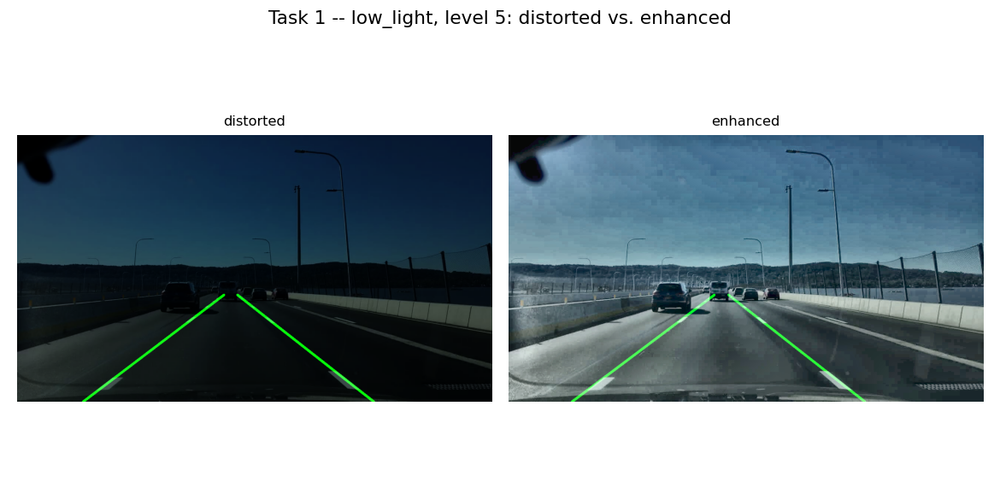 |
| 2 — Feature Matching | 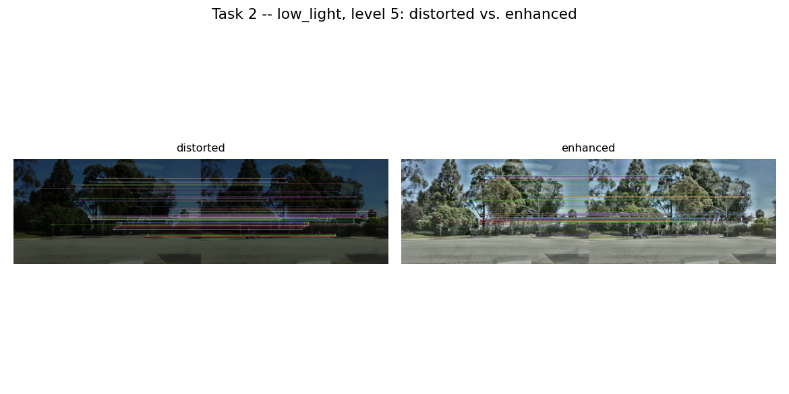 |
| 3 — Vehicle Detection | 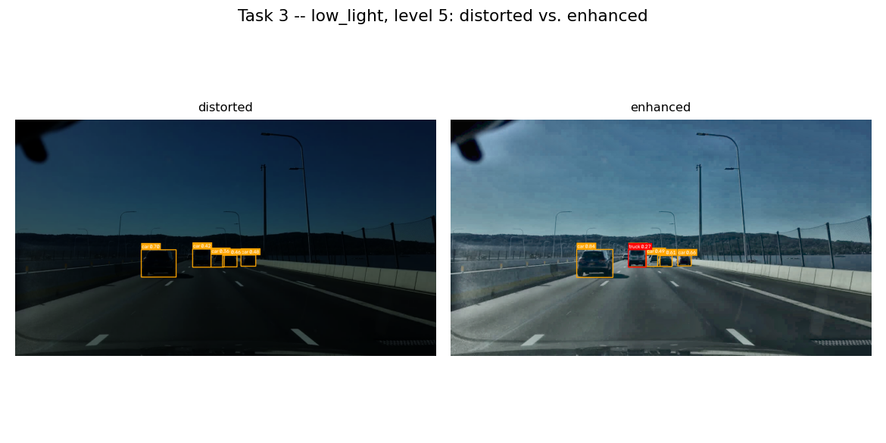 |

`motion_blur` and `rain` before/after examples are also available:
`docs/readme_assets/enhancements/task{1,2,3}/before_after_{motion_blur,rain}.png`.

## Task 1 Enhancement Results

3×3 grid — rows: motion_blur / low_light / rain; columns: Level 1 / Level 5
/ Level 9; enhanced lane detection under distortions:

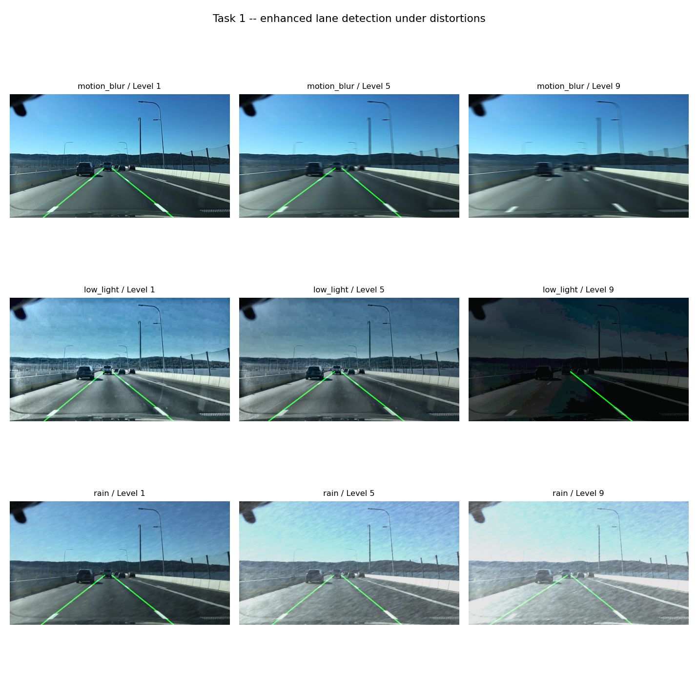

Comparison — clean baseline vs. distorted vs. enhanced:


Survival rate improves clearly for `low_light`/`motion_blur`, but `rain`
actually gets slightly *worse* — the bilateral de-rain filter smooths the
same thin edges Hough needs, along with the rain streaks it's meant to
remove.

## Task 2 Enhancement Results

3×3 grid — enhanced feature matching under distortions:

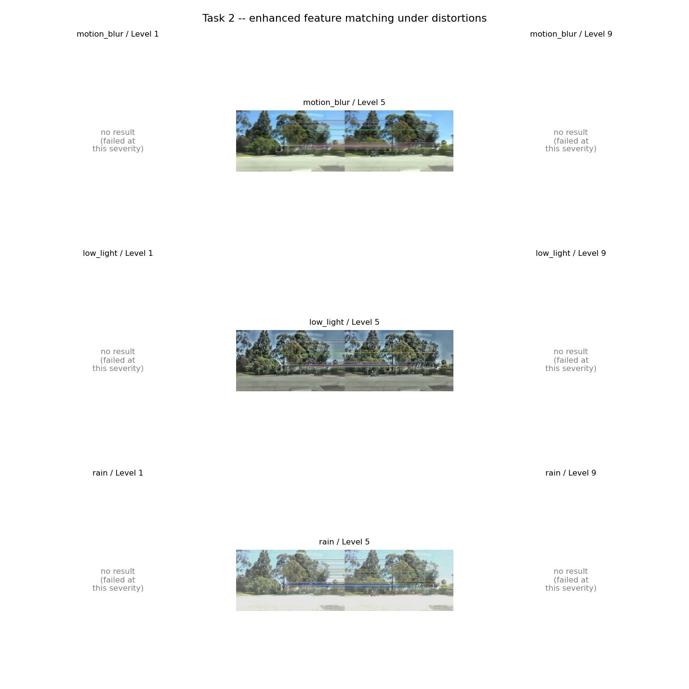

Comparison — clean baseline vs. distorted vs. enhanced:

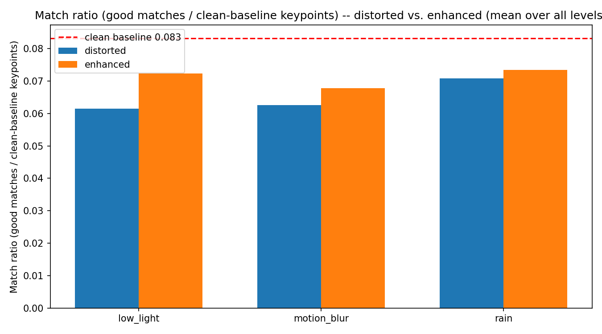

Match ratio improves for `motion_blur`/`rain`, roughly flat for `low_light`.

## Task 3 Enhancement Results

3×3 grid — enhanced vehicle detections under distortions:

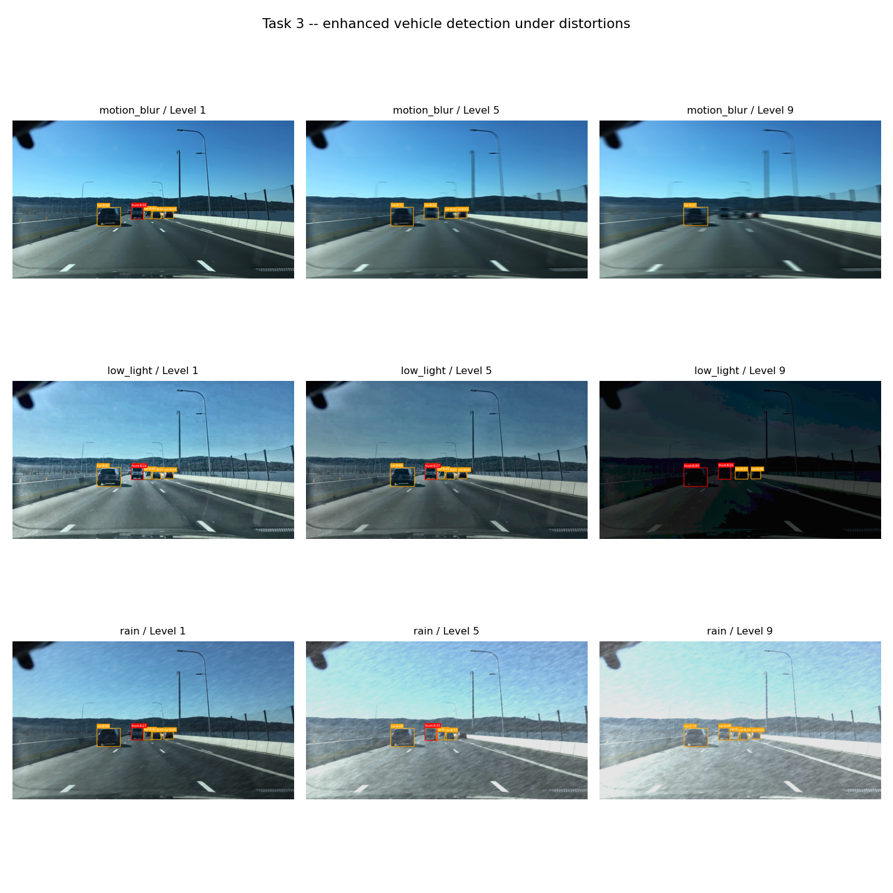

Comparison — clean baseline vs. distorted vs. enhanced:


Recall improves for `low_light`/`rain`, flat for `motion_blur` — enhancement
functions tuned for one distortion don't uniformly transfer to a different
failure mode.

---

# 5. Fine Tuning

## 5.1 Fine Tuning Approach

Task 3 (Vehicle Detection) was selected for fine-tuning because it is the
project's one deep-learning model (YOLOv8n) and the only task with **real
ground truth** available — real GT lets us generate correct training labels
directly, without relying on pseudo-labels from the (imperfect) pretrained
model's own output. Fine-tuning is expected to help because it directly
adapts the model's learned features to the distorted domain, rather than
relying on pre-processing to make a distorted image merely *resemble* a
clean one to an otherwise-unchanged model.

## 5.2 Training Setup

| Parameter | Value |
|---|---|
| Model | `yolov8n.pt` (pretrained on COCO) |
| Dataset | 300 images, each distorted at a fixed moderate severity (level 5/9), round-robin across the 3 distortions; labeled with real BDD100K GT; 80/20 train/val split |
| Epochs | 15 |
| Batch size | 8 |

(Trained on CPU; final validation mAP50 = 0.222, mAP50-95 = 0.142.)

Training visualizations (auto-generated by `ultralytics` during training):

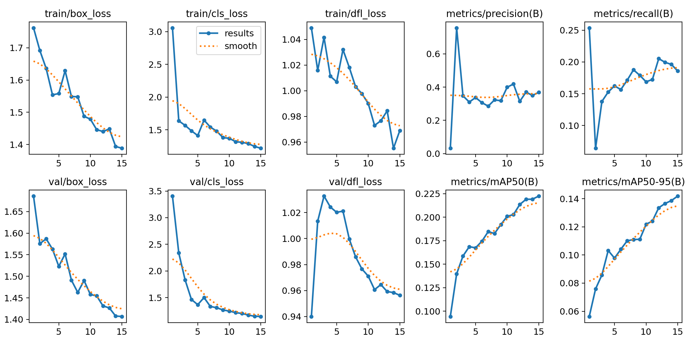
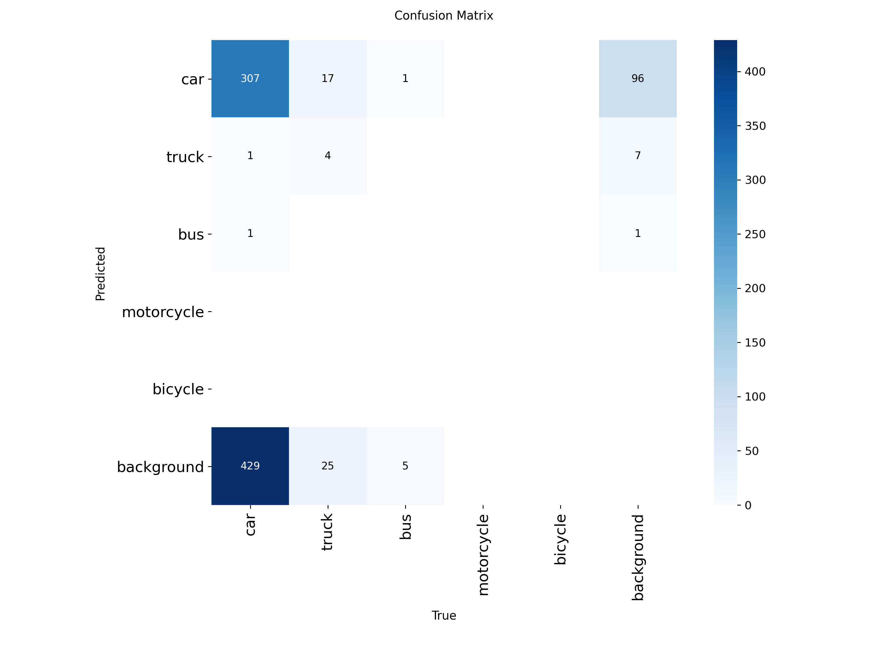

## 5.3 Comparison Before and After Fine Tuning

Compare: pretrained model (distorted input) vs. pretrained model + enhanced
input vs. fine-tuned model (distorted input):

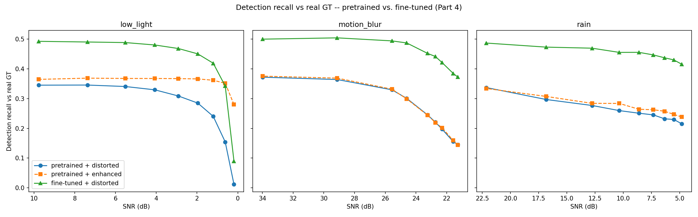

**Mean recall across all 9 levels:**

| Distortion | pretrained + distorted | pretrained + enhanced | fine-tuned + distorted |
|---|---|---|---|
| `low_light` | 0.262 | 0.355 | **0.414** |
| `motion_blur` | 0.259 | 0.261 | **0.451** |
| `rain` | 0.260 | 0.275 | **0.452** |

Fine-tuning clearly wins on all three distortions, and the gap over
enhancement is largest exactly where enhancement helped least
(`motion_blur`, `rain`). Enhancement tries to make a distorted image "look
clean" to an unchanged model; fine-tuning directly adapts the model's
weights to the distorted domain, which generalizes better when the
enhancement itself is an imperfect proxy for the original clean signal. The
advantage narrows only at the most extreme low-light levels, where
information loss is severe enough that neither approach fully recovers it.

---

# 6. Known Issues and Limitations

- **Missing real GT for Task 1 and Task 2**: BDD100K ships lane-marking and
  fine-grained-matching-relevant annotations as separate label releases we
  don't have locally, so both tasks fall back to pseudo-GT (clean-image
  output as the reference) rather than human-labeled ground truth.
- **Dataset limitations**: Task 3's clean-image folder was pruned from 675 →
  300 images to match Task 1 exactly and guarantee 100% real-GT coverage
  (the excluded 375 images appear to be BDD100K MOT/tracking frames, not
  part of the labeled detection set). This subset also has zero
  `motorcycle`/`bicycle` GT instances, so those two classes have no
  per-class results. 105 of the original 300 Task 3 images were additionally
  found to be corrupt at the source (all-zero byte content) and were
  replaced with valid copies from the full BDD100K 100k-image set before
  any of the numbers in this README were produced.
- **Computational limitations**: fine-tuning ran on CPU with a small,
  fixed-severity training set (240 images, one distortion/level each, 15
  epochs) — a larger, more varied training set and more epochs (ideally on
  GPU) would likely improve the fine-tuned model further.
- **Other known problems**: SNR is a uniform-noise proxy and does not
  perfectly reflect perceptual severity for structured distortions like
  rain; `match_ratio`-style metrics that normalize by keypoint count can
  behave counter-intuitively when the underlying keypoint yield itself
  changes a lot (see Task 2 metrics discussion, section 2.2).

---

# 7. Repository Structure

```
config.py                            # central path config, shared constants, BDD100K category map
enhancements.py                      # Part 4 restoration functions per distortion (shared, all 3 tasks)

Amit_project/
  augmentations_AMIT.py              # distortion functions: apply_motion_blur / apply_low_light / apply_rain
  augmentation_levels.py             # builds the 9 severity levels + SNR computation (shared, all 3 tasks)
  feature_matching_bdd100k.py        # ORB feature matching core (process_pair)
  vehicle_detection_bdd100k.py       # YOLOv8n detection core (process_image)
  run_feature_matching_degradation.py  # Task 2 driver: baseline + distorted + enhanced sweep
  run_vehicle_detection_degradation.py # Task 3 driver: baseline + distorted + enhanced sweep, real GT, per-class
  build_finetune_dataset.py          # Fine-tuning: distorted training set + real-GT labels
  finetune_vehicle_detection.py      # Fine-tuning: fine-tune yolov8n.pt
  compare_finetuned_vs_pretrained.py # Fine-tuning: final comparison plots
  yolov8n.pt / yolov8n_finetuned.pt  # pretrained / fine-tuned YOLOv8-nano weights

src_Alon/
  lane_detection/
    lane_detection_pipeline.py       # Task 1 core (process_image)
    run_lane_detection_degradation.py  # Task 1 driver: baseline + distorted + enhanced sweep
  helper_files/
    extract_task3_gt.py              # extracts real BDD100K box2d GT for Task 3's image subset
    filter_bdd100k.py, import_tags.py  # BDD100K dataset curation utilities
  archive/                            # superseded disk-based Task 1 scripts, kept for reference

tools/
  build_readme_assets.py             # fills docs/readme_assets/ from existing outputs (this README's images)
  build_distortion_grids.py          # generates the 9-level distortion example grids
  make_smoke_test_sample.py          # small dev sample for fast iteration/quick-checks

data/
  clean_images/                      # raw BDD100K image subsets (NOT in git — see .gitignore)
  gt_labels/task3_vehicle_gt.csv      # real BDD100K GT for Task 3 (tracked in git, small)
  finetune_dataset/                  # fine-tuning training set (regenerable, images not in git)

outputs/
  csv_results/task{1,2,3}/           # CSVs (baseline, degraded, enhanced, level summaries)
  graph_results/task{1,2,3}/         # summary plots (bar/line charts)
  visualizations/task{1,2,3}/        # before/after/enhanced sample images
outputs_finetuned/task3/             # fine-tuned model's sweep results

docs/
  3002_CousreProject.pdf             # course assignment brief
  readme_assets/                     # every image embedded in this README, organized by section:
    dataset/{task1_task3_examples,task2_examples}/
    baseline/task{1,2,3}/
    distortions/{low_light,motion_blur,rain}/
    distortion_results/task{1,2,3}/
    enhancements/task{1,2,3}/
    finetuning/
```
